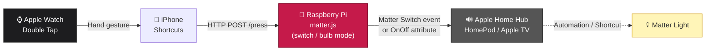
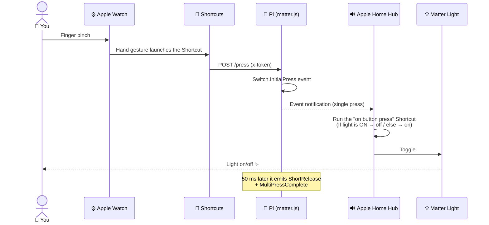
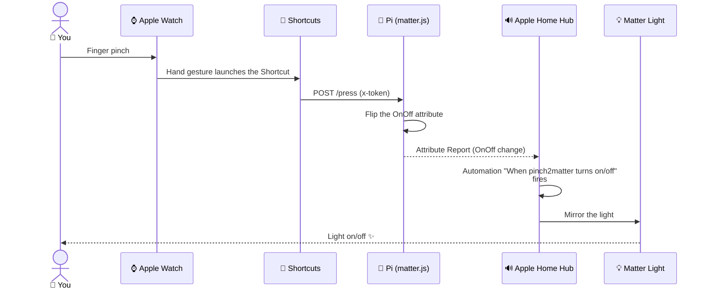

# pinch2matter 🤏→💡

🇯🇵 [日本語](./README.md) | 🇬🇧 English

> Toggle a Matter light with an Apple Watch Double Tap (the "finger pinch" gesture).
> Runs a virtual Matter device with matter.js on a Raspberry Pi, commissions it into a Matter controller (Apple Home / Google Home), and exposes an HTTP endpoint that an iOS Shortcut can hit from the Watch.
> The device type can be switched between a **stateless switch (button)** and an **OnOff Light (bulb)** via an environment variable.

[](https://nodejs.org/)
[](https://github.com/project-chip/matter.js)
[](LICENSE)

## Demo


## Verified setups

| Controller | switch mode | bulb mode |
|---|---|---|
| Apple Home | ✅ | ✅ |
| Google Home | not tested | ✅ |

> Running automations in Apple Home requires a Home Hub such as a HomePod or an Apple TV.

## Architecture



## Operating flow

### switch mode (Generic Switch / button)



### bulb mode (OnOff Light / virtual bulb)



## Requirements

- A Raspberry Pi or a macOS / Linux machine
- Node.js 18 or later (22 recommended)
- Apple Watch Series 9 / Ultra 2 (native Double Tap), or Series 4+ with AssistiveTouch
- iPhone
- A Home Hub (HomePod / HomePod mini / Apple TV, etc.) — needed when adding/automating via Apple Home
- A Matter-compatible light (a virtual Matter light is fine if you don't have a physical one)
- The same LAN / same SSID (an mDNS-routable path)
- A **static IP** for the Pi (a DHCP reservation is easiest) — the URLs hardcode the IP, so a changing address breaks the iOS Shortcut

## Setup

```bash
git clone https://github.com/<you>/pinch2matter.git
cd pinch2matter
npm install
npm start                                  # starts in switch mode
```

`npm start` works on its own, but the `x-token` auth key defaults to **`change-me`**. Even on a LAN, that lets anyone hit `/press` or `/factory-reset`, so **set your own token**:

```bash
# Start with a token (recommended)
PINCH2MATTER_TOKEN=your-secret npm start

# Start in bulb mode
PINCH2MATTER_MODE=bulb PINCH2MATTER_TOKEN=your-secret npm start
```

### Environment variables

| Variable | Default | Description |
|---|---|---|
| `PINCH2MATTER_TOKEN` | `change-me` | The `x-token` auth key for write endpoints. **Always change this.** |
| `PINCH2MATTER_MODE` | `switch` | `switch` (button) or `bulb` (light bulb) |
| `PINCH2MATTER_PORT` | `3000` | HTTP server listen port |
| `PINCH2MATTER_STORAGE` | `./.matter` | Where fabric data is stored |

### Device mode (`PINCH2MATTER_MODE`)

| Mode | Matter device type | Appearance in the controller | Trigger | Endpoint to call |
|---|---|---|---|---|
| `switch` (default) | Generic Switch (Momentary) | Button | `InitialPress` / `ShortRelease` / `LongPress` events | `POST /press` (+ `/double-press` `/long-press`) |
| `bulb` | OnOff Light | Light bulb | OnOff transitioning to `true` (Attribute Report) | `POST /press` (= `/toggle`) |

> **In both modes the Watch Shortcut just calls `POST /press`** — no need to rebuild it when you switch modes (it acts as a button press in switch mode, and an on/off toggle in bulb mode).

> When switching modes, always **run `npm run reset` to wipe storage, then remove the old accessory from Apple Home** before restarting. Layering a different device type onto the same fabric breaks things.

When started, the pairing QR and manual code appear in the log:

```text
✅ Matter device started
📷 Scan this QR in Apple Home:
MT:...........
🔢 Manual pairing code: 3496-...-...
🌐 HTTP listening on :3000
```

### 1. Add to Apple Home

The pairing info is also **viewable directly from your iPhone's browser** (handy when running under systemd where you can't easily tail logs):

```
http://<Pi-IP>:3000/pairing
```

> 📌 **Assign the Pi a static IP (a DHCP reservation on your router is easiest).** mDNS names like `raspberrypi.local` don't always resolve depending on the network, and the iOS Shortcut (and the URLs here) hardcode the IP — so if DHCP hands out a new address, your setup breaks. With a static IP, the URL you set once keeps working.

- Before pairing: shows the QR code and manual code. The page auto-refreshes every 5 seconds, so it flips to "paired" once commissioning completes.
- After pairing: a "Reopen commissioning" button (requires `x-token`) issues a temporary code for adding the device to another Apple Home / Matter controller.

Steps:

1. Open `http://<Pi-IP>:3000/pairing` in the iPhone's browser
2. Home app → top-right `+` → "Add Accessory"
3. Scan the QR on the page (or long-press the manual code on the `/pairing` page to copy it and tap "More Options" → "Enter Code Manually")
4. "pinch2matter" appears (manufacturer: reomaru)
   - `switch` mode: a **Button** tile (tapping does nothing on its own — assign an action from ⚙️ Settings)
   - `bulb` mode: a **Light bulb** tile (tap to toggle on/off)

The QR and manual code also appear in the startup log (`journalctl -u pinch2matter -f`). The "Runtime info" card at the top of `/pairing` shows the current mode, storage path, and fabric count.

> **Note**: matter.js uses **on-network commissioning**, so Bluetooth is not needed. Discovery is via mDNS (DNS-SD) on the LAN — `_matterc._udp.local` while awaiting commissioning, `_matter._tcp.local` after. If commissioning fails, "I don't have a code or can't scan" → "More Options" gives a list of Matter devices visible on the LAN, which often makes diagnosis quicker.

### 2. Configure the action on the Apple Home side

The wiring differs per mode.

#### switch mode: turn a button press into a toggle via "Convert to Shortcut"

Apple Home only offers "Set Accessories and Scenes" for a stateless switch (so just on **or** off, not "toggle"). To get "if currently on, turn off; otherwise turn on", convert the action to a shortcut.

1. Tap the **pinch2matter** button tile in the Home app → ⚙️ Settings
2. In the **Single Press** action settings (and Double Press / Long Press if you want), choose **"Add or Remove Accessories and Scenes"**
3. Scroll to the bottom and tap **"Convert to Shortcut"**
4. Delete the existing `Set …` tile
5. Add **Scripting** → **If**
6. Set the If input by tapping **"Select Home Accessory"** → pick the target light, with the condition **"is on"**
7. **Inside the If branch**: add "Set Accessories and Scenes" and turn the light **off**
8. **Inside the Otherwise branch**: add "Set Accessories and Scenes" and turn the light **on**
9. "Done" in the top-right

A single press of the pinch2matter button now toggles the light.

| If branch | Action |
|---|---|
| Light is on | Turn off |
| Light is off | Turn on |

> To wire Double / Long Press to different actions (a scene, a different room, …), hit `/double-press` and `/long-press` from separate Shortcuts.

#### bulb mode: mirror the bulb state onto the real light with an automation

In bulb mode pinch2matter itself holds an ON/OFF state, so the canonical setup is two automations: "when pinch2matter turns on → turn the real light on", and "when it turns off → turn the real light off".

1. Home app → "Automation" tab → top-right `+` → "An Accessory is Controlled"
2. **Trigger**: pinch2matter (accessory) **Turns On**
3. **Action**: Turn the target light **On**
4. Same idea for the second one: pinch2matter **Turns Off** → real light **Off**

Now every `/press` (= `/toggle`) flips pinch2matter's state, and Apple Home keeps the real light in sync.

> Google Home works the same way: mirror the real light with a Routine triggered by pinch2matter turning on/off (verified in bulb mode).

### 3. iOS Shortcut (Watch → Pi)

| Action | Settings |
|---|---|
| URL | `http://<Pi-IP>:3000/press` |
| Web Request > Get Contents of URL | Method: `POST` / Headers: `x-token` = the token set at startup |

> If you want Double / Long Press, make matching Shortcuts that POST to `/double-press` and `/long-press`.

### 4. Bind to Apple Watch Double Tap

- **Series 9 / Ultra 2**: the native Double Tap cannot be bound to a Shortcut directly. On the Watch, **Settings > Accessibility > AssistiveTouch > Hand Gestures** → bind "Double Tap (Pinch)" to the Shortcut above.
- **Alternative**: place the Shortcut on a Complication or in the Smart Stack → one-tap launch. In practice the speed is comparable.

## HTTP API

| Method | Path | Auth | switch | bulb | Purpose |
|---|---|---|---|---|---|
| `GET` | `/health` | — | ✓ | ✓ | mode + commissioned + state |
| `GET` | `/pairing` | — | ✓ | ✓ | QR / manual code HTML page |
| `POST` | `/pairing/reopen` | `x-token` | ✓ | ✓ | Reopen the commissioning window for 15 min |
| `POST` | `/factory-reset` | `x-token` | ✓ | ✓ | Wipe all fabrics + storage, then exit the process |
| `POST` | `/press` | `x-token` | ✓ | ✓ | switch: InitialPress→ShortRelease→MPC(1) / bulb: flip state (same as `/toggle`) |
| `POST` | `/double-press` | `x-token` | ✓ | — | switch only. 400 in bulb mode |
| `POST` | `/long-press` | `x-token` | ✓ | — | switch only. 400 in bulb mode |
| `POST` | `/toggle` | `x-token` | — | ✓ | bulb only. Flips the OnOff state. 400 in switch mode |

```bash
curl -X POST http://<Pi-IP>:3000/press \
  -H "x-token: your-token"
# switch: {"ok":true,"kind":"single"}
# bulb:   {"ok":true,"kind":"single"}   (internally toggles)

curl http://<Pi-IP>:3000/health
# switch: {"ok":true,"mode":"switch","commissioned":true,"fabrics":1,"storage":"/.../.matter","position":0}
# bulb:   {"ok":true,"mode":"bulb","commissioned":true,"fabrics":1,"storage":"/.../.matter","on":false}

curl -X POST http://<Pi-IP>:3000/pairing/reopen \
  -H "x-token: your-token"
# → {"ok":true,"qrPairingCode":"MT:...","manualPairingCode":"3496-..."}

curl -X POST http://<Pi-IP>:3000/factory-reset \
  -H "x-token: your-token"
# → {"ok":true,"method":"server.factoryReset()" or "manual rm", ...}
# The process exits — systemd brings it back via Restart=always, otherwise run `npm start` again.
```

## Decommissioning / Reset

How to do a clean reset when you change controllers or are iterating during development. **Removing the accessory only from Apple Home leaves fabric data behind on the matter.js side**, which makes re-pairing flaky, so you need to clear both sides.

### A. Manual reset (local development)

```bash
# 1. Remove pinch2matter from the Home app on iPhone
# 2. Stop the server (Ctrl+C or systemctl stop)
npm run reset      # Deletes ./.matter ./storage ./*.storage and ~/.matter/pinch2matter-node
npm start          # A fresh QR appears
```

> `~/.matter/pinch2matter-node` is also wiped because older versions of this project saved fabrics under matter.js's default path (home directory) — leftover data there will conflict with re-pairing. The current version writes to `./.matter` in the project directory (overridable via `PINCH2MATTER_STORAGE`).

### B. Reset from HTTP (remote reset while the server runs)

```bash
curl -X POST http://<host>:3000/factory-reset -H "x-token: ..."
# The process exits, storage is wiped.
# Under systemd, Restart=always brings it back up.
# Don't forget to remove the old accessory on the iPhone side before re-pairing.
```

> `/factory-reset` first tries `server.factoryReset()` (the matter.js API), and falls back to manually `rm`-ing `.matter/` `storage/` `*.storage`. The `method` field of the response tells you which path was taken.

## Auto-start (systemd)

`/etc/systemd/system/pinch2matter.service`:

```ini
[Unit]
Description=pinch2matter
After=network-online.target

[Service]
Type=simple
WorkingDirectory=/home/pi/pinch2matter
ExecStart=/usr/bin/node --max-old-space-size=256 index.js
Environment=PINCH2MATTER_TOKEN=your-secret-here
Restart=always
User=pi

[Install]
WantedBy=multi-user.target
```

```bash
sudo systemctl daemon-reload
sudo systemctl enable --now pinch2matter
```

## Running on Pi Zero 2 W

The Pi Zero 2 W has 512 MB RAM / a quad-core Cortex-A53 / 2.4 GHz Wi-Fi only, so:

### 1. Expand swap to 1 GB

The native builds run during `npm install` OOM-kill themselves with the default 100 MB swap.

```bash
sudo dphys-swapfile swapoff
sudo sed -i 's/^CONF_SWAPSIZE=.*/CONF_SWAPSIZE=1024/' /etc/dphys-swapfile
sudo dphys-swapfile setup
sudo dphys-swapfile swapon
free -h    # Swap should now read 1.0Gi
```

### 2. Cap Node's heap

Pass `--max-old-space-size=256` in `ExecStart` of the systemd unit (see above).

### 3. Wi-Fi is 2.4 GHz only

The Pi Zero 2 W has **no 5 GHz support**. If your mesh Wi-Fi unifies 2.4 / 5 GHz under one SSID, fine; if SSIDs are split, make sure the Pi and the Apple Home Hub end up on the **same SSID** (mDNS doesn't cross 2.4 ↔ 5 GHz cleanly).

## Security notes

- This repo uses `vendorId: 0xfff1` (CSA's test vendor ID). **Personal / development use only** — you can't ship anything store-grade with it.
- `x-token` is light-weight LAN-only protection. Don't expose this to the open internet. If you must, put a TLS reverse proxy in front and upgrade to a proper Bearer token.
- `.matter/` and `storage/` contain fabric secrets. **Do not commit them** (already excluded via `.gitignore`).

## License

MIT — see [LICENSE](LICENSE).
