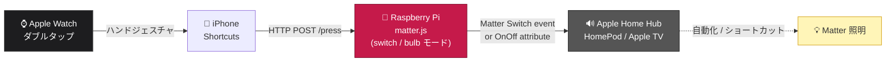
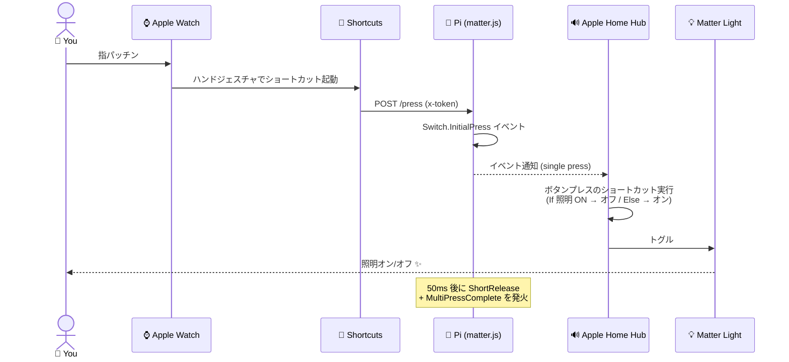
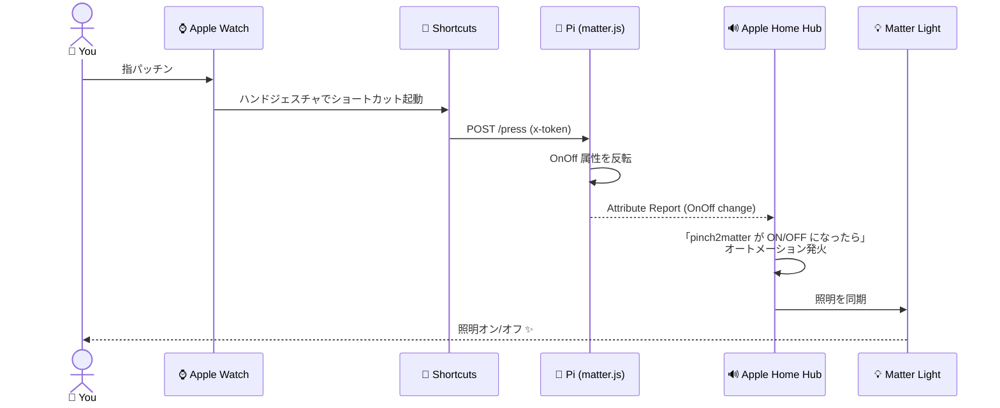

# pinch2matter 🤏→💡

🇯🇵 日本語 | 🇬🇧 [English](./README.en.md)

> Apple Watch のダブルタップ(指パッチン)で部屋の照明をトグルする。
> Raspberry Pi 上の matter.js で仮想 Matter デバイスを Matter コントローラ (Apple Home / Google Home) にコミッショニングし、iOS ショートカットから HTTP で叩く構成。
> デバイス型は環境変数で **ステートレススイッチ (ボタン)** と **OnOff Light (電球)** を切り替え可能。

[](https://nodejs.org/)
[](https://github.com/project-chip/matter.js)
[](LICENSE)

## デモ


## 確認済み環境

| コントローラ | switch モード | bulb モード |
|---|---|---|
| Apple Home | ✅ | ✅ |
| Google Home | 未確認 | ✅ |

> Apple Home でオートメーションを動かすには、HomePod や Apple TV のようなホームハブが必要です。

## アーキテクチャ



## 動作フロー

### switch モード (Generic Switch / ボタン)



### bulb モード (OnOff Light / 仮想電球)



## 必要なもの

- Raspberry Piまたは macOS / Linux マシン
- Node.js 18 以上 (推奨 22)
- Apple Watch Series 9 / Ultra 2 (ネイティブのダブルタップ)、または Series 4 以降 + AssistiveTouch
- iPhone
- ホームハブ (HomePod / HomePod mini / Apple TV など) — Apple Home で追加・オートメーションする場合に必要
- Matter 対応の照明 (なければ Matter 仮想ライトでも代用可)
- 同一 LAN / 同一 SSID (mDNS が通る経路であること)
- Pi に**固定IP**(ルータの DHCP 予約が手軽) — URL に IP を直書きするため、IP が変わると iOS ショートカットが壊れる

## セットアップ

```bash
git clone https://github.com/<you>/pinch2matter.git
cd pinch2matter
npm install
npm start                                  # switch モードで起動
```

`npm start` だけでも起動しますが、認証キー `x-token` の既定値は **`change-me`** です。LAN 内で誰でも `/press` や `/factory-reset` を叩けるので、**自分のトークンを指定して起動**する点に注意:

```bash
# トークンを指定して起動 (推奨)
PINCH2MATTER_TOKEN=your-secret npm start

# 電球モードで起動
PINCH2MATTER_MODE=bulb PINCH2MATTER_TOKEN=your-secret npm start
```

### 環境変数

| 変数 | 既定値 | 説明 |
|---|---|---|
| `PINCH2MATTER_TOKEN` | `change-me` | 書き込み系エンドポイントの `x-token` 認証キー。**必ず変更する** |
| `PINCH2MATTER_MODE` | `switch` | `switch`(ボタン)または `bulb`(電球) |
| `PINCH2MATTER_PORT` | `3000` | HTTP サーバの待受ポート |
| `PINCH2MATTER_STORAGE` | `./.matter` | fabric 情報などの保存先 |

### デバイスモード (`PINCH2MATTER_MODE`)

| モード | Matter デバイス型 | コントローラ上の見た目 | トリガ | 叩くエンドポイント |
|---|---|---|---|---|
| `switch` (デフォルト) | Generic Switch (Momentary) | ボタン | InitialPress / ShortRelease / LongPress イベント | `POST /press`(+ `/double-press` `/long-press`) |
| `bulb` | OnOff Light | 電球 | OnOff = true への遷移 (Attribute Report) | `POST /press`(= `/toggle`) |

> **どちらのモードでも、Watch のショートカットは `POST /press` を叩けば OK** です。モードを変えてもショートカットを作り直す必要はない(switch では押しボタン、bulb では ON/OFF トグルとして動作します)。

> モードを切り替えるときは **`npm run reset` で必ずストレージを wipe → Apple Home からも古いデバイスを削除** してから再起動してください (同じ fabric に違うデバイス型を被せると壊れます)。

起動するとペアリング用 QR とマニュアルコードがログに出ます。

```text
✅ Matter device started
📷 Scan this QR in Apple Home:
MT:...........
🔢 Manual pairing code: 3496-...-...
🌐 HTTP listening on :3000
```

### 1. Apple Home に追加

ペアリング情報は **iPhone のブラウザから直接見られます**(systemd で動かしていてログを追えない場合に便利):

```
http://<Pi の IP>:3000/pairing
```

> 📌 **Pi には固定IP(ルータの DHCP 予約が手軽)を割り当てておくことを推奨**します。`raspberrypi.local` のような mDNS 名はネットワークによっては名前解決できないことがあり、また iOS ショートカットなどは URL に IP を直書きするため、DHCP で IP が変わると設定が壊れます。固定IPなら一度設定した URL をそのまま使い続けられます。

- 未ペアリング時: QR コード + マニュアルコードを表示。ページは 5 秒ごとに自動更新され、ペアリングが完了すると「ペアリング済み」表示に切り替わる。
- ペアリング済み時: 「コミッショニングを再オープン」ボタン (要 `x-token`) で別の Apple Home / Matter コントローラ用の一時コードを発行できる。

手順:

1. iPhone のブラウザで `http://<Pi の IP>:3000/pairing` を開く
2. 「ホーム」アプリ → 右上「+」→「アクセサリを追加」
3. ページの QR をスキャン(または `/pairing` のマニュアルコードを長押しコピーして「コードを入力」)
4. 「pinch2matter」が登録される(製造元: reomaru)
   - `switch` モード: **ボタン** タイル (タップでは何も起こらない。⚙️設定からアクションを割り当てる)
   - `bulb` モード: **電球** タイル (タップで ON/OFF できる)

QR / マニュアルコードは起動ログにも出ます (`journalctl -u pinch2matter -f`)。`/pairing` ページ上部の「ランタイム情報」カードで現在のモード・ストレージパス・fabric 数も確認できます。

> **メモ**: matter.js は **on-network コミッショニング** なので Bluetooth は不要です。同一 LAN 上の mDNS (DNS-SD) で発見されます。コミッショニング待機中は `_matterc._udp.local` 、登録後は `_matter._tcp.local` を広告します。失敗時は「コードがないか、スキャンできない」→「その他のオプション」で LAN 上の Matter デバイス一覧を確認すると切り分けが早いです。

### 2. Apple Home 側のアクション設定

モードによってアクションの紐づけ方が違います。

#### switch モード: ボタンプレスをショートカット変換でトグル化

Apple Home はステートレススイッチに対し「アクセサリとシーンを設定」しか出ない (= ON/OFF のどちらか固定) ため、「現在オンならオフ、オフならオン」のトグル動作にはショートカットへの変換が必要です。

1. 「ホーム」アプリで **pinch2matter** ボタンをタップ → ⚙️ 設定を開く
2. 「**シングルプレス**」(必要なら「ダブルプレス」「長押し」も同様) のアクション設定で **「アクセサリとシーンの追加または削除」** を選択
3. 一番下までスクロールし **「ショートカットに変換」** をタップ
4. 既存の `Set …` タイルを削除
5. 「**スクリプティング**」 → **If** を追加
6. If の入力で「**ホームアクセサリを選択**」 → 対象の照明を選び、条件を **「オンである」** に設定
7. **If の中** に「アクセサリとシーンを設定」を追加し、対象の照明を **オフ**
8. **Otherwise の中** に「アクセサリとシーンを設定」を追加し、対象の照明を **オン**
9. 右上「完了」

これで pinch2matter ボタンのシングルプレス = 照明トグルになります。

| If 分岐 | 動作 |
|---|---|
| 照明がオン | オフにする |
| 照明がオフ | オンにする |

> ダブルプレス / 長押しに別の動作 (シーン切替・別の部屋など) を割り当てるなら、index.js の `/double-press` `/long-press` を別のショートカットで叩けば OK。

#### bulb モード: 状態をオートメーションで実電球にミラーする

bulb モードは pinch2matter 自体が ON/OFF 状態を持つので、Apple Home オートメーションで「pinch2matter が ON になったら実電球を ON」「OFF になったら OFF」の 2 本を組むのが基本形。

1. 「ホーム」アプリ → 「オートメーション」タブ → 右上「+」→「アクセサリを操作」
2. **トリガ**: pinch2matter (アクセサリ) が **オンになる**
3. **アクション**: 対象の実電球を **オンにする**
4. 同じ要領でもう 1 本: pinch2matter が **オフになる** → 実電球を **オフにする**

これで `/press` (= /toggle) を叩く度に pinch2matter の状態が反転し、Apple Home が実電球を同期させます。

> Google Home でも同様に、bulb の ON/OFF をトリガにした「ルーティン」で実照明をミラーできます(bulb モードのみ確認済み)。

### 3. iOS ショートカット (Watch → Pi の呼び出し)

| アクション | 設定 |
|---|---|
| URL | `http://<Pi の IP>:3000/press` |
| Webリクエスト>URL の内容を取得 | 方法: `POST` / ヘッダ: `x-token` = 起動時のトークン |

> ダブル/長押しを使うなら `/double-press` `/long-press` 用のショートカットも同様に作る。

### 4. Apple Watch のダブルタップに割り当て

- **Series 9 / Ultra 2**: ネイティブのダブルタップにショートカットを直接バインドはできない。Watch の「設定 > アクセシビリティ > AssistiveTouch > ハンドジェスチャ」→ ダブルタップ(指パッチン)を上記ショートカットへバインド。
- **代替案**: コンプリケーションまたは Smart Stack にショートカットを配置 → 1 タップ起動。実用上のスピードはほぼ同じ。

## HTTP API

| メソッド | パス | 認証 | switch | bulb | 用途 |
|---|---|---|---|---|---|
| `GET` | `/health` | 不要 | ✓ | ✓ | mode + commissioned + state |
| `GET` | `/pairing` | 不要 | ✓ | ✓ | QR / マニュアルコード HTML |
| `POST` | `/pairing/reopen` | `x-token` | ✓ | ✓ | コミッショニングウィンドウを 15 分再オープン |
| `POST` | `/factory-reset` | `x-token` | ✓ | ✓ | 全 fabric 削除 + ストレージ wipe + プロセス終了 |
| `POST` | `/press` | `x-token` | ✓ | ✓ | switch: InitialPress→ShortRelease→MPC(1) / bulb: 状態を反転 (= `/toggle` と同じ) |
| `POST` | `/double-press` | `x-token` | ✓ | — | switch のみ。bulb では 400 |
| `POST` | `/long-press` | `x-token` | ✓ | — | switch のみ。bulb では 400 |
| `POST` | `/toggle` | `x-token` | — | ✓ | bulb のみ。状態を反転。switch では 400 |

```bash
curl -X POST http://<Pi の IP>:3000/press \
  -H "x-token: 設定したトークン"
# switch: {"ok":true,"kind":"single"}
# bulb:   {"ok":true,"kind":"single"}   (内部的にトグルする)

curl http://<Pi の IP>:3000/health
# switch: {"ok":true,"mode":"switch","commissioned":true,"fabrics":1,"storage":"/.../.matter","position":0}
# bulb:   {"ok":true,"mode":"bulb","commissioned":true,"fabrics":1,"storage":"/.../.matter","on":false}

curl -X POST http://<Pi の IP>:3000/pairing/reopen \
  -H "x-token: 設定したトークン"
# → {"ok":true,"qrPairingCode":"MT:...","manualPairingCode":"3496-..."}

curl -X POST http://<Pi の IP>:3000/factory-reset \
  -H "x-token: 設定したトークン"
# → {"ok":true,"method":"server.factoryReset()" or "manual rm", ...}
# プロセスが終了するので systemd なら自動復帰、ローカルなら npm start で再起動
```

## コミッショニング解除 / リセット

開発中やコントローラを変えるときに完全リセットしたい場合の手順。**Apple Home からアクセサリを取り除くだけだと matter.js 側に fabric データが残り、再ペアリングが妙な挙動になる**ので、両側を消す必要があります。

### A. 手動リセット (ローカル開発向け)

```bash
# 1. iPhone「ホーム」アプリで pinch2matter を取り除く
# 2. サーバを止める (Ctrl+C または systemctl stop)
npm run reset      # ./.matter ./storage ./*.storage + ~/.matter/pinch2matter-node を削除
npm start          # 新しい QR が出る
```

> `~/.matter/pinch2matter-node` も巻き取って消しているのは、過去バージョンが matter.js のデフォルトパス (ホームディレクトリ配下) に保存していた fabric が残っていると再ペアリングで干渉するため。現バージョンはプロジェクト配下の `./.matter` に保存します (`PINCH2MATTER_STORAGE` で変更可)。

### B. HTTP からリセット (サーバ稼働中の遠隔リセット)

```bash
curl -X POST http://<host>:3000/factory-reset -H "x-token: ..."
# プロセスが exit し、ストレージは wipe 済み
# systemd なら Restart=always で自動的に上がり直す
# その後 iPhone 側でも古いアクセサリを取り除いて再ペアリング
```

> `/factory-reset` は `server.factoryReset()` (matter.js の API) を試し、無ければ手動で `.matter/` `storage/` `*.storage` を `rm` するフォールバックを実装しています。レスポンスの `method` フィールドでどちらが使われたか確認できます。

## 自動起動 (systemd)

`/etc/systemd/system/pinch2matter.service`:

```ini
[Unit]
Description=pinch2matter
After=network-online.target

[Service]
Type=simple
WorkingDirectory=/home/pi/pinch2matter
ExecStart=/usr/bin/node --max-old-space-size=256 index.js
Environment=PINCH2MATTER_TOKEN=your-secret-here
Restart=always
User=pi

[Install]
WantedBy=multi-user.target
```

```bash
sudo systemctl daemon-reload
sudo systemctl enable --now pinch2matter
```

## Pi Zero 2 W で動かす場合の注意

Pi Zero 2 W は 512MB RAM / クアッドコア Cortex-A53 / 2.4GHz Wi-Fi only という構成なので、以下を踏まえてセットアップする。

### 1. swap を 1GB に拡張

`npm install` 中に native ビルドが走るとデフォルトの 100MB swap では OOM-killed される。

```bash
sudo dphys-swapfile swapoff
sudo sed -i 's/^CONF_SWAPSIZE=.*/CONF_SWAPSIZE=1024/' /etc/dphys-swapfile
sudo dphys-swapfile setup
sudo dphys-swapfile swapon
free -h    # Swap が 1.0Gi になっていれば OK
```

### 2. Node の heap 上限を絞る

systemd unit の `ExecStart` で `--max-old-space-size=256` を渡す(上記 unit ファイル参照)。

### 3. Wi-Fi は 2.4GHz のみ

Pi Zero 2 W は **5GHz 非対応**。メッシュ Wi-Fi で 2.4/5GHz が同一 SSID に統合されていれば問題ないが、SSID が分かれている場合は Pi と Apple Home Hub が **同一 SSID** に居ることを必ず確認する(mDNS が 2.4↔5 を越えにくいため)。

## セキュリティに関する注意

- 本リポジトリは `vendorId: 0xfff1` (CSA のテストベンダ ID) を使用する。**個人利用 / 開発向け** であり、Matter非認証デバイスとなります。
- `.matter/` `storage/` 配下には fabric 秘密鍵が入る。**コミット禁止** (`.gitignore` で除外済み)。

## ライセンス

MIT — 詳細は [LICENSE](LICENSE) を参照。
